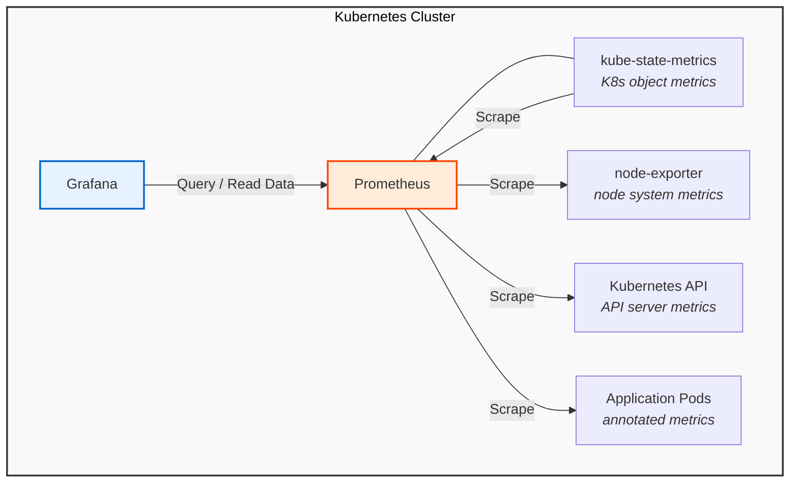

# Monitoring Stack Documentation

## Overview

The PerfEng local Kubernetes cluster includes a minimal but complete
observability stack deployed in the `monitoring` namespace. This stack provides
the foundation for performance telemetry collection and correlation.

## Components

| Component          | Version | Purpose                        | Port                   |
| ------------------ | ------- | ------------------------------ | ---------------------- |
| Prometheus         | v2.53.0 | Metrics collection and storage | 9090                   |
| kube-state-metrics | v2.13.0 | Kubernetes object metrics      | 8080                   |
| node-exporter      | v1.8.2  | Node-level system metrics      | 9100                   |
| Grafana            | v11.1.0 | Visualization dashboards       | 3000 (NodePort: 30300) |

## Architecture

Thramsorm this to mermaid:



## Access

### Grafana

- **URL**: http://localhost:30300
- **Username**: admin
- **Password**: admin
- **Datasource**: Prometheus (pre-configured)

### Prometheus

Prometheus is not exposed via NodePort. Use port-forwarding:

```bash
kubectl port-forward -n monitoring svc/prometheus 9090:9090
```

Then access: [http://localhost:9090](http://localhost:9090)

### Prometheus Configuration

#### Scrape Intervals

- Default: 15 seconds
- Evaluation: 15 seconds

#### Retention

- Time: 7 days
- Size: 8GB

#### Scrape Targets

| Job                     | Target                     | Purpose                   |
| ----------------------- | -------------------------- | ------------------------- |
| `prometheus`            | `localhost:9090`           | Self-monitoring           |
| `kubernetes-apiservers` | Kubernetes API             | API server metrics        |
| `kubernetes-nodes`      | Kubelet                    | Node metrics              |
| `kube-state-metrics`    | kube-state-metrics service | Kubernetes object metrics |
| `node-exporter`         | node-exporter endpoints    | System metrics            |
| `kubernetes-pods`       | Annotated pods             | Application metrics       |

### Recording Rules

#### cluster:node_cpu:avg

```promql
avg(rate(node_cpu_seconds_total{mode!="idle"}[5m])) \* 100
```

Average CPU usage across all nodes (percentage).

#### cluster:pod_cpu:sum

```promql
sum(rate(container_cpu_usage_seconds_total{container!=""}[5m])) by (namespace, pod)
```

CPU usage summed by namespace and pod.

#### cluster:node_memory:avg

```promql
avg(node_memory_MemTotal_bytes - node_memory_MemAvailable_bytes) / avg(node_memory_MemTotal_bytes) \* 100
```

Average memory usage across all nodes (percentage).

#### cluster:pod_count:sum

```promql
sum(kube_pod_info) by (namespace)
```

Pod count by namespace.

### Common Queries

#### Node CPU Usage

```promql
100 - (avg(rate(node_cpu_seconds_total{mode="idle"}[5m])) \* 100)
```

#### Pod Memory Usage

```promql
sum(container_memory_working_set_bytes{container!=""}) by (namespace, pod)
```

#### Pod Restart Count

```promql
sum(kube_pod_container_status_restarts_total) by (namespace, pod)
```

#### Deployment Replicas

```promql
kube_deployment_status_replicas_available
```

### Adding Application Metrics

To have Prometheus scrape application metrics, add these annotations to your pod spec:

```yaml
metadata:
annotations:
prometheus.io/scrape: 'true'
prometheus.io/port: '8080'
prometheus.io/path: '/metrics'
```

| Component  | PVC               | Size | StorageClass |
| ---------- | ----------------- | ---: | ------------ |
| Prometheus | `prometheus-data` | 10Gi | `standard`   |
| Grafana    | `grafana-data`    |  5Gi | `standard`   |

### Management Commands

#### Install

```bash
make monitoring-up
```

#### Uninstall

```bash
make monitoring-down
```

#### Check Status

```bash
kubectl get pods -n monitoring
```

### View Logs

```bash
# Prometheus
kubectl logs -n monitoring -l app=prometheus

# Grafana
kubectl logs -n monitoring -l app=grafana

# kube-state-metrics
kubectl logs -n monitoring -l app=kube-state-metrics

# node-exporter
kubectl logs -n monitoring -l app=node-exporter
```

### Troubleshooting

#### Prometheus not scraping targets

```bash
# Check Prometheus targets
kubectl port-forward -n monitoring svc/prometheus 9090:9090

# Open http://localhost:9090/targets

# Check Prometheus logs
kubectl logs -n monitoring -l app=prometheus --tail=100
```

#### Grafana cannot connect to Prometheus

```bash
# Check Grafana datasource
kubectl exec -n monitoring -l app=grafana -- cat /etc/grafana/provisioning/datasources/datasources.yaml

# Check Prometheus service
kubectl get svc -n monitoring prometheus
```

#### No data in Grafana

```bash
# Check Prometheus is scraping
kubectl logs -n monitoring -l app=prometheus --tail=50 | grep "scrape"

# Check recording rules
kubectl port-forward -n monitoring svc/prometheus 9090:9090

# Open http://localhost:9090/rules
```

#### Persistent volume issues

```bash
# Check PVC status
kubectl get pvc -n monitoring

# Check PV status
kubectl get pv

# Check storage class
kubectl get storageclass
```

### Resource Usage

| Component          | CPU Request | CPU Limit | Memory Request | Memory Limit |
| ------------------ | ----------: | --------: | -------------: | -----------: |
| Prometheus         |        100m |      500m |          256Mi |          1Gi |
| kube-state-metrics |         50m |      200m |           64Mi |        256Mi |
| node-exporter      |         50m |      200m |           32Mi |        128Mi |
| Grafana            |         50m |      300m |          128Mi |        512Mi |

## Future Enhancements

1. **Prometheus Operator**: Migrate to operator for better CRD support
2. **Alertmanager**: Add alerting capabilities
3. **Custom dashboards**: PerfEng-specific dashboards for performance metrics
4. **Long-term storage**: Thanos or Cortex for extended retention
5. **Federation**: Multi-cluster metric aggregation
6. **ServiceMonitors**: Migrate from static config to ServiceMonitor CRDs
