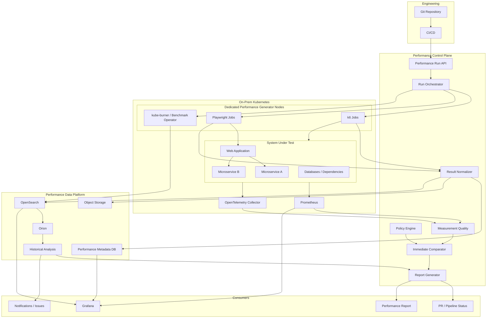
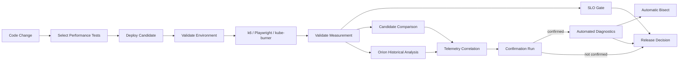

# Continuous Performance Engineering - Platform Proposal

## 1. Executive Summary

This proposal defines a production-grade **Continuous Performance Engineering
Platform** for an on-premises Kubernetes environment.

The platform will automate and continuously improve performance validation for
two primary workload categories:

1. **Microservice/API performance tests**, implemented with **k6**.
2. **Web performance tests**, implemented with **Playwright**, including
   application-specific measurements such as:
    - click → requested information displayed;
    - submit → confirmation rendered;
    - navigation → application state usable;
    - search → results visible;
    - user action → asynchronous UI update completed.

The objective goes significantly beyond automating test execution.

The completed platform will provide:

- repeatable test execution;
- workload and environment versioning;
- SLO/performance-budget validation;
- candidate-versus-reference comparison;
- measurement-quality validation;
- automated performance regression detection;
- historical trend analysis;
- statistical change-point detection;
- Kubernetes and application telemetry correlation;
- regression diagnosis assistance;
- performance test selection and prioritization;
- automatic regression localization/bisection;
- capacity and scalability testing;
- dashboards and engineering reports;
- release-quality gates with calibrated confidence;
- lifecycle management for baselines;
- long-term performance evidence.

The implementation follows an incremental maturity model because reliable
performance automation cannot be created by simply choosing a statistical test
and running each benchmark five times.

Grafana similarly recommends treating automated performance testing as a
continuous process at multiple SDLC stages, rather than assuming that every
large test belongs directly in a deployment pipeline. It explicitly warns that
simple Pass/Fail gates can produce false confidence until the verification
process is mature.

Red Hat's OpenShift Performance and Scale organization followed the same
evolution: automated workloads first, integration with normal engineering CI,
informing tests, earlier regression detection, and ultimately continuous
performance analysis with tools such as Orion.

The fundamental principle of this project is therefore:

> **Automate measurement first, establish measurement trustworthiness second,
automate judgement progressively, and make performance decisions blocking only
after their reliability has been demonstrated empirically.**

---

# 2. Project Vision

The project will create a common platform through which engineering teams can
ask:

> What effect did this software change have on performance?

The platform should eventually answer not only:

```text
Performance regression detected.
```

but:

```text
checkout-submit-to-confirmation:
    candidate: 824 ms
    reference: 681 ms
    change: +21.0%

Regression confidence:
    high

Regression introduced:
    between builds 4812 and 4817

Correlated changes:
    checkout-service p95       +18%
    PostgreSQL query p95       +31%
    CPU                         +3%
    GC pause                    unchanged
    Kubernetes throttling       unchanged

Likely affected component:
    checkout persistence path

Probable introducing commit:
    34be9f8
```

That is the distinction between a **load-testing pipeline** and a **continuous
performance engineering system**.

---

# 3. Scope

## 3.1 Application Performance Testing

The platform covers application-level tests implemented with:

### k6

Used for:

- individual microservice APIs;
- REST services;
- GraphQL where applicable;
- service workflows;
- asynchronous/API workflows;
- representative business transactions;
- concurrency testing;
- throughput testing;
- stress testing;
- capacity testing;
- soak testing.

### Playwright

Used for:

- browser-driven application performance;
- end-user workflow latency;
- JavaScript/rendering-related performance;
- frontend/backend combined interactions;
- custom business-level UI latency.

Examples include:

```text
click "Search"
       ↓
results actually visible

click "Save"
       ↓
confirmation visible

select customer
       ↓
customer details rendered

submit workflow
       ↓
new workflow state visible
```

These measurements are intentionally different from generic page-load metrics.

---

# 4. Kubernetes Platform Performance

The platform will additionally support infrastructure-level tests such as:

- Kubernetes control-plane scalability;
- pod startup latency;
- scheduling latency;
- service creation latency;
- namespace density;
- pod density;
- network performance;
- image-pull performance;
- storage performance;
- node scalability;
- infrastructure churn;
- cluster behavior under application load.

This is where the **Cloud-Bulldozer ecosystem** becomes especially valuable.

---

# 5. Explicit Decision: Role of Cloud-Bulldozer

Cloud-Bulldozer should be adopted, but **not as the universal application
performance-test framework**.

The architecture deliberately assigns different responsibilities to its
components.

## 5.1 kube-burner

### Use kube-burner for

- Kubernetes performance and scale workloads;
- pod/node/service/PVC lifecycle measurements;
- cluster-density testing;
- Kubernetes churn tests;
- selected scheduled platform benchmarks;
- Prometheus metric snapshots around important performance runs;
- creation of Cloud-Bulldozer-compatible datasets where Orion analysis is
  desired.

kube-burner is specifically designed as a Kubernetes performance and scale
orchestration tool. Its core capabilities include resource operations at scale,
Prometheus metric collection, indexing, measurements, and alerting.

It also has direct measurements for Kubernetes lifecycle events such as pod
readiness, service readiness, node readiness and PVC operations.

### Do not use kube-burner to

- execute k6 application workloads;
- execute Playwright browser workloads;
- sit between every test and Prometheus;
- become the universal application result format;
- replace the standard Kubernetes observability stack.

This avoids making application testing dependent on a Kubernetes-scale
benchmarking tool.

---

# 6. Should kube-burner Always Collect Infrastructure Metrics?

**No.**

That would create unnecessary architectural coupling.

Infrastructure monitoring should work independently of whether any performance
test is executing.

The standard flow is:

```text
Kubernetes
    │
    ├── application metrics
    ├── kube-state-metrics
    ├── node metrics
    ├── container metrics
    └── infrastructure metrics
             │
             ▼
        Prometheus
```

Prometheus remains the source of operational telemetry.

Performance tests record:

```text
runStart
runEnd
runId
```

The platform then queries the relevant time interval:

```text
Prometheus:

    runStart <= timestamp <= runEnd
```

This makes test infrastructure independent from Cloud-Bulldozer.

---

# 7. Where kube-burner Metric Collection Is Useful

kube-burner provides an `index` mode that can collect Prometheus metrics for a
specified start/end period independently of running a kube-burner workload.

This is useful for selected high-value tests.

For example:

```text
nightly full performance test
        │
        ├── k6
        ├── Playwright
        │
        ▼
test interval recorded
        │
        ▼
kube-burner index
        │
        ├── configured Prometheus profiles
        └── run metadata
        │
        ▼
OpenSearch
        │
        ▼
Orion
```

Therefore the recommendation is:

| Test                                   | kube-burner telemetry snapshot |
|----------------------------------------|--------------------------------|
| PR performance smoke                   | No                             |
| PR component benchmark                 | Normally no                    |
| scheduled API regression               | Optional                       |
| nightly representative system test     | Yes                            |
| release performance qualification      | Yes                            |
| Kubernetes scalability benchmark       | Yes                            |
| capacity test                          | Yes                            |
| cluster-upgrade performance validation | Yes                            |

This gives the project compatibility with the Cloud-Bulldozer analysis ecosystem
without introducing it into every execution.

kube-burner supports local, TSDB, Elasticsearch and OpenSearch indexing,
including export/import patterns suitable for restricted or disconnected
environments.

That capability is particularly suitable for an on-premises cluster.

---

# 8. Benchmark Operator Decision

**Benchmark Operator will not orchestrate ordinary application tests.**

It will be deployed in the performance environment for infrastructure benchmark
suites.

Its stated purpose is to deploy common workloads for establishing Kubernetes
infrastructure performance baselines.

Appropriate workloads include:

```text
CPU
memory
disk
network
image pulling
cluster scale
kube-burner workloads
```

This provides an infrastructure-performance dimension complementary to the
application tests.

For example:

```text
Application regression?
         │
         ├── k6 degradation
         └── infrastructure benchmark unchanged

→ application is more likely responsible
```

versus:

```text
Application regression
+
storage benchmark regression
+
node disk latency increase

→ infrastructure likely involved
```

---

# 9. Orion Decision

**Orion will become the historical performance-regression analysis engine.**

It will not replace immediate SLO checks.

Orion currently provides:

- regression detection;
- Apache Otava/Hunter-based change-point analysis;
- multiple analysis algorithms;
- JSON output;
- JUnit output;
- historical metadata matching;
- multi-PR comparison;
- JIRA integration.

Red Hat uses Orion operationally in OpenShift continuous performance testing.

One published example shows Orion automatically detecting:

- approximately 30% kubelet CPU increase;
- approximately 50% pod-ready latency increase.

The regression was then reproduced and diagnosed.

The platform will therefore expose regression analysis through an interface:

```text
RegressionAnalyzer
        │
        ├── ImmediateComparator
        └── HistoricalAnalyzer
                 │
                 ▼
               Orion
```

This avoids coupling the entire platform implementation directly to Orion.

---

# 10. Apache Otava Decision

Apache Otava is the underlying change-point technology of interest.

It identifies points in a historical metric sequence where subsequent
observations differ statistically from previous behavior. Smaller regressions
naturally require more observations before they can be confidently identified.

Because Orion already integrates the Hunter/Otava approach:

**Do not initially integrate Otava separately.**

Use:

```text
Platform
   ↓
Orion
   ↓
Otava/Hunter
```

Direct Otava integration remains available if later requirements demand an
analysis path independent from Cloud-Bulldozer metadata conventions.

---

# 11. Overall Reference Architecture



---

# 12. Performance Control Plane

A dedicated control-plane component should eventually own performance-test
execution.

This avoids embedding complex orchestration logic separately in:

```text
GitHub Actions
Jenkins
Tekton
GitLab CI
etc.
```

CI should make a declarative request:

```yaml
testSuite: checkout-regression
candidate: sha256:...
reference: release-2026.08

profile: nightly

environment:
  name: perf-k8s-01
```

The Performance Run API creates a unique:

```text
performanceRunId
```

and controls the lifecycle.

---

# 13. Run State Machine

A run should have explicit states.

```text
CREATED
   ↓
VALIDATING
   ↓
PROVISIONING
   ↓
WARMING_UP
   ↓
RUNNING
   ↓
COLLECTING
   ↓
ANALYZING
   ↓
REPORTING
   ↓
COMPLETED
```

Failure states include:

```text
INVALID
ABORTED
INFRASTRUCTURE_FAILURE
TEST_FAILURE
INCONCLUSIVE
```

This distinction matters.

A Kubernetes scheduling problem must not appear as:

```text
PERFORMANCE REGRESSION
```

---

# 14. Kubernetes Execution Architecture

Performance generators should not compete with the SUT for resources.

Create dedicated performance-generator nodes.

Example:

```text
worker-perf-01
worker-perf-02
worker-perf-03
```

with:

```text
label:
    workload=performance-generator

taint:
    workload=performance-generator:NoSchedule
```

Then k6 and Playwright jobs receive matching tolerations and node affinity.

The benefits are:

- more stable generators;
- reduced resource interference;
- predictable CPU availability;
- easier monitoring;
- easier generator-capacity validation.

---

# 15. Isolation of the SUT

Where practical, the SUT should also run on controlled worker pools.

For serious regression testing:

```text
Generator nodes
       ≠
SUT nodes
```

For higher-confidence tests:

```text
Performance SUT nodes
       ≠
shared development workload nodes
```

Red Hat explicitly identifies environment isolation and
production-representative environments as central continuous-performance-testing
practices.

---

# 16. k6 Test Architecture

Tests should separate:

```text
business scenario
       from
workload profile
```

Example:

```text
tests/
  checkout/
    scenario.js

profiles/
  smoke.yaml
  average.yaml
  regression.yaml
  stress.yaml
  capacity.yaml
```

The same checkout scenario can then execute as:

```text
checkout + smoke
checkout + average
checkout + regression
checkout + stress
```

Grafana similarly recommends modularizing test scenario and workload
configuration.

---

# 17. k6 Workload Models

For backend systems that receive independent traffic, use arrival-rate models
wherever they better represent production demand.

The fundamental distinction is:

### Closed model

```text
client request
      ↓
wait
      ↓
next request
```

If the server slows down, generated traffic may also decrease.

### Open model

```text
configured arrival rate
        ↓
requests continue arriving
```

This is generally more suitable for systems whose arrival rate is externally
driven.

Each workload must explicitly document its model.

---

# 18. k6 SLOs

k6 thresholds will implement the first performance gate.

For example:

```javascript
thresholds: {
    http_req_failed: ['rate<0.005'],
        http_req_duration
:
    ['p(95)<300', 'p(99)<750'],
}
```

k6 thresholds are specifically designed as automated Pass/Fail performance
criteria and are commonly used to express SLOs.

However:

```text
k6 threshold
```

is an:

```text
SLO gate
```

not the historical regression detector.

---

# 19. k6 Metrics Collection

k6 produces both:

- built-in metrics;
- custom metrics.

Its metric types include counters, gauges, rates and trends.

Each run should retain:

```text
HTTP latency distribution
failure rate
throughput
iteration duration
connection timing
custom business metrics
workload achieved
VUs
dropped iterations where applicable
```

A critical quality metric for arrival-rate tests is whether the generator
actually delivered the intended workload.

---

# 20. Do Not Depend on Prometheus Remote Write for the Core Result Path

k6 can stream its results to Prometheus-compatible remote-write endpoints.

However, the current k6 Prometheus remote-write output remains marked
**experimental**.

Therefore:

```text
k6 → Prometheus remote write
```

may be supported for visualization, but it should **not be the only
authoritative result pipeline**.

The authoritative path is:

```text
k6
 ↓
machine-readable test result
 ↓
normalizer
 ↓
performance result store
```

k6 supports timestamped granular result output as well as aggregated summaries.

---

# 21. Playwright Performance Architecture

Playwright introduces a fundamentally different measurement problem.

Consider:

```text
click button
     ↓
HTTP request
     ↓
microservice
     ↓
database
     ↓
HTTP response
     ↓
JavaScript processing
     ↓
DOM update
     ↓
browser rendering
     ↓
result visible
```

A user cares about the complete interval.

Therefore:

```text
HTTP response duration
```

is insufficient.

---

# 22. Browser-Side Timing Is Mandatory

Avoid measuring UI latency primarily like this:

```typescript
const start = Date.now();
await button.click();
await result.waitFor();
const duration = Date.now() - start;
```

This includes Playwright controller scheduling and communication and does not
precisely represent the browser event/render timeline.

Instead, use browser-side high-resolution timestamps.

The Browser Performance API provides:

```text
performance.mark()
performance.measure()
PerformanceObserver
```

for precisely this purpose.

Playwright can execute JavaScript directly inside the page using
`page.evaluate()`, allowing the browser's own Performance API to be accessed.

---

# 23. Preferred Playwright Measurement Model

The preferred approach is **application-assisted semantic instrumentation**.

For example, the application emits:

```javascript
performance.mark("search.started");
```

when the user initiates search.

After results are rendered:

```javascript
performance.mark("search.results-visible");

performance.measure(
    "search.action-to-visible",
    "search.started",
    "search.results-visible"
);
```

The test retrieves:

```text
search.action-to-visible.duration
```

This measurement represents the actual business interaction.

The browser User Timing API is explicitly designed for custom high-resolution
application performance events of this kind.

---

# 24. Black-Box Playwright Measurement

Application modification is not always possible.

Therefore the platform should also provide a browser instrumentation helper.

Conceptually:

```text
install browser-side observer
        ↓
detect click event
        ↓
record start
        ↓
observe required DOM/application state
        ↓
wait until rendering condition
        ↓
record browser-side completion
        ↓
return duration
```

Potential mechanisms include:

- MutationObserver;
- application event;
- PerformanceObserver;
- element visibility criterion;
- known accessibility state;
- request + render completion.

The important point is:

```text
measurement clock = browser
```

rather than:

```text
measurement clock = Playwright controller
```

---

# 25. Defining "Displayed"

A standard definition is required.

`locator.isVisible()` alone does not necessarily mean that the user has seen the
rendered result.

The project should provide semantic completion strategies.

For example:

```yaml
measurement:
  name: search-results-visible

  start:
    event: click
    target: "#search-button"

  completion:
    element: "#results"
    condition: visible

  renderConfirmation:
    animationFrames: 2
```

For particularly important flows, application instrumentation is preferable.

---

# 26. UI Performance Metrics

The normalized metric naming model should distinguish business interactions.

Examples:

```text
ui.search.action_to_visible_ms
ui.checkout.submit_to_confirmation_ms
ui.customer.open_to_details_ms
ui.dashboard.refresh_to_complete_ms
```

Also collect browser context:

```text
browser
browserVersion
viewport
deviceScaleFactor
headless
CPU architecture
runner node
cache profile
```

---

# 27. Cold and Warm Browser Scenarios

Do not mix cold and warm interaction samples.

Create separate profiles:

```text
browser-cold
browser-warm
```

A cold test may include:

- new BrowserContext;
- empty HTTP cache;
- no local storage;
- no service-worker cache where controllable.

A warm test may intentionally retain:

- connection reuse;
- cache;
- authenticated session;
- preloaded JavaScript.

These are different user experiences and require different baselines.

---

# 28. Browser Version Control

Playwright performance runners must use a pinned:

```text
Playwright version
browser binary version
container image digest
```

Otherwise a browser upgrade can become indistinguishable from an application
regression.

Browser changes should intentionally create a new comparison cohort.

---

# 29. Common Normalized Result Model

k6 and Playwright must eventually converge on the same result contract.

Example:

```json
{
  "schemaVersion": 1,
  "run": {
    "id": "perf-018247",
    "suite": "checkout",
    "profile": "nightly",
    "timestamp": "..."
  },
  "test": {
    "type": "browser",
    "tool": "playwright",
    "toolVersion": "..."
  },
  "candidate": {
    "gitSha": "...",
    "imageDigest": "..."
  },
  "environment": {
    "cluster": "...",
    "fingerprint": "..."
  },
  "metric": {
    "name": "ui.checkout.submit_to_confirmation_ms",
    "direction": "lower-is-better"
  },
  "distribution": {
    "samples": 40,
    "median": 671,
    "p90": 731,
    "p95": 754,
    "p99": 811
  }
}
```

The statistical system must not care whether a metric originated from:

```text
k6
Playwright
kube-burner
Benchmark Operator
```

---

# 30. Test Metadata Model

Every run needs extensive provenance.

## Software

```text
Git SHA
container digest
application version
configuration hash
feature flags
database migration version
```

## Test

```text
test ID
test version
workload version
tool
tool version
```

## Environment

```text
cluster
Kubernetes version
node pool
node model
CPU architecture
kernel
container runtime
CNI
storage class
```

## Runtime resources

```text
replicas
CPU requests
CPU limits
memory requests
memory limits
HPA configuration
```

## Data

```text
dataset ID
dataset version
database size
seed version
```

Without these properties a historical result eventually becomes difficult or
impossible to interpret.

---

# 31. Environment Fingerprint

The platform generates a canonical fingerprint from performance-relevant
dimensions.

For example:

```text
SHA256(
    clusterClass
    kubernetesVersion
    nodeCPU
    runtime
    applicationConfiguration
    datasetVersion
    workloadVersion
)
```

Comparison policy determines which fields are:

```text
REQUIRED_EQUAL
INFORMATIONAL
IGNORED
```

Example:

```yaml
comparisonCompatibility:
  workloadVersion: required
  browserMajorVersion: required
  nodeCpuModel: required
  kubernetesPatchVersion: informational
```

---

# 32. Environment Compatibility Gate

Before comparing results:

```text
reference
    +
candidate
    ↓
Compatibility Evaluator
```

Possible outcomes:

```text
COMPATIBLE
PARTIALLY_COMPATIBLE
INCOMPATIBLE
```

An incompatible test does not become:

```text
FAIL
```

It becomes:

```text
INVALID_COMPARISON
```

---

# 33. Observability Architecture

The observability layer should be permanently available.

## Prometheus

Collect:

### Kubernetes

```text
node CPU
node memory
node network
node disk
container CPU
container memory
CPU throttling
pod restarts
pod scheduling
HPA state
```

### Applications

```text
request duration
request rate
error rate
queue depth
connection pool usage
thread pool state
runtime/GC
cache metrics
```

### Databases

```text
query latency
connections
locks
buffer/cache statistics
I/O
replication lag
```

---

# 34. OpenTelemetry

OpenTelemetry should provide distributed traces for representative transactions.

Each performance test receives:

```text
performanceRunId
scenarioId
iterationId where practical
```

Requests should carry correlation metadata.

For example:

```text
X-Performance-Run-Id
X-Performance-Scenario
```

Application observability instrumentation can add those fields as trace/log
attributes.

This allows:

```text
slow Playwright interaction
          ↓
specific backend trace
          ↓
slow span
          ↓
specific service/query
```

---

# 35. Run Window Correlation

Every run records exact test phases:

```text
provisionStart
warmupStart
measurementStart
measurementEnd
cooldownEnd
```

Infrastructure analysis normally uses only:

```text
measurementStart → measurementEnd
```

This avoids mixing warm-up with steady-state telemetry.

---

# 36. Raw vs Derived Data

Three levels should be retained.

## Level 1 — Raw Evidence

Examples:

```text
k6 granular output
Playwright samples
browser traces for failures
Prometheus metric extracts
OpenTelemetry traces where retained
logs
```

Store these in object storage.

---

## Level 2 — Normalized Results

Examples:

```text
per-run distributions
p50
p90
p95
p99
throughput
error rate
resource aggregates
```

Store in the performance data platform.

---

## Level 3 — Analysis

Examples:

```text
+12.6% regression
confidence high
change point build 4817
probable database correlation
```

Store as analysis records.

Never overwrite raw measurements when analysis algorithms change.

This allows historical reanalysis.

---

# 37. Storage Architecture

For on-prem Kubernetes, use three distinct stores.

## Object Storage

Prefer S3-compatible storage such as existing enterprise object storage or
MinIO.

Store:

```text
raw k6 results
Playwright traces
screenshots
HTML reports
metric snapshots
diagnostic bundles
profiling output
```

---

# 38. Metadata Database

Use PostgreSQL for:

```text
run identity
configuration
environment fingerprints
status
test catalogue
baseline relationships
policy versions
analysis results
artifact references
```

The relational model is appropriate for orchestration and auditability.

---

# 39. OpenSearch

Adopt OpenSearch as the historical analysis/indexing layer used for:

```text
queryable historical performance metrics
Cloud-Bulldozer outputs
selected Prometheus snapshots
Orion-compatible metadata
```

This choice provides a direct integration path because kube-burner supports
OpenSearch indexing.

It also aligns with Orion's current operational model.

This does **not** require replacing Prometheus.

The distinction is:

```text
Prometheus
    operational time-series telemetry

OpenSearch
    test-scoped historical analysis dataset
```

---

# 40. Grafana

Grafana provides the primary interactive visualization layer.

Dashboards should support:

```text
current run
candidate vs reference
historical trend
resource correlation
browser interaction trends
capacity trends
environment comparison
```

The performance report itself remains generated and versioned independently.

---

# 41. Immediate Decision Model

A completed test will produce several separate verdicts.

```text
Test Health
SLO
Regression
Environment
```

Example:

```text
TEST HEALTH: PASS
SLO:         PASS
REGRESSION:  WARN
ENVIRONMENT: PASS
```

Overall:

```text
WARN
```

---

# 42. Result States

Use:

| State        | Meaning                                 |
|--------------|-----------------------------------------|
| PASS         | Acceptable                              |
| WARN         | Suspicious and requires investigation   |
| FAIL         | Credible material regression/SLO breach |
| UNSTABLE     | Excessive measurement variability       |
| INVALID      | Execution/environment invalid           |
| INCONCLUSIVE | Evidence insufficient                   |

This prevents infrastructure faults from being reported as application failures.

---

# 43. Performance Requirements

Each metric may have two policies.

Example:

```yaml
metric: checkout.submit_to_confirmation

slo:
  p95: 1200ms

regression:
  practicalDifference: 0.10
```

Suppose:

```text
reference = 700 ms
candidate = 850 ms
```

Then:

```text
SLO:
850 < 1200
PASS

Regression:
+21.4%
FAIL/WARN
```

The system correctly reports:

```text
Meets requirement but has regressed.
```

---

# 44. Practical Significance

A statistically detectable difference is not automatically operationally
important.

Each metric therefore defines a **minimum practical effect**.

Examples:

```text
service latency: 5–10%
browser interaction: 8–15%
throughput: 5%
CPU/resource usage: workload-specific
```

These values are initially hypotheses.

They will be calibrated using collected measurements.

---

# 45. Measurement Variability

Do not use a universal:

```text
CV < 10%
```

rule.

Coefficient of Variation is useful as one stability indicator, but thresholds
must be empirical and metric-specific.

The platform should track:

```text
mean
median
MAD
standard deviation
CV
percentile variability
```

and determine normal variability from repeated unchanged executions.

---

# 46. Calibration Campaign

Before a regression policy becomes blocking, execute controlled repetitions of:

```text
same application
same environment
same workload
```

This creates a **noise baseline**.

For each metric determine:

```text
within-run variability
between-run variability
between-day variability
environment variability
```

This is one of the most important stages of the project.

---

# 47. Controlled Regression Experiments

The regression detector must then be tested against known changes.

Introduce deliberately:

```text
+5 ms service latency
+10 ms
+25 ms
```

and:

```text
CPU reduction
memory restriction
database latency
connection pool restriction
network latency
additional frontend rendering
```

Then measure:

```text
true positives
true negatives
false positives
false negatives
```

A detector can then have a documented capability such as:

```text
For regressions ≥10%:

sensitivity: 96%
false positive rate: 2.7%
```

Only then is it appropriate to consider blocking releases.

---

# 48. Immediate Baseline Comparator

Initially the platform will support:

### Approved Reference

```text
candidate vs approved known-good
```

### Previous Successful Build

```text
candidate vs previous
```

### Candidate/Control Experiment

```text
reference deployment
candidate deployment
```

The latter should be used for important qualification runs.

---

# 49. Candidate/Control Execution

On shared on-prem hardware, temporal infrastructure differences matter.

A strong experiment is:

```text
Reference
Candidate
Candidate
Reference
```

or another balanced execution ordering.

This reduces the danger that:

```text
morning → reference
afternoon → candidate
```

environmental drift becomes interpreted as software change.

Candidate/reference instances should not generate competing resource contention
if executed concurrently unless that is explicitly part of the experiment.

---

# 50. Baseline Lifecycle

Baselines are first-class entities.

Each baseline records:

```text
baseline ID
software version
workload version
environment class
dataset version
creation date
validation status
sample count
approver/reason
```

States:

```text
CANDIDATE
QUALIFIED
APPROVED
RETIRED
```

---

# 51. Avoid Baseline Drift

Never blindly promote:

```text
latest passing result
```

to become the next baseline.

Otherwise:

```text
100
103
106
109
112
115
```

can normalize gradual degradation.

Maintain:

```text
approved anchor baseline
+
rolling history
```

---

# 52. Historical Regression Detection

Once enough history exists, Orion becomes active.

Instead of merely:

```text
candidate vs baseline
```

the platform analyzes:

```text
build
 │
 │    ● ● ● ●
 │            ● ● ● ●
 │
 └─────────────────────>
```

and asks:

> Where did the statistical behavior change?

Apache Otava describes this specifically as finding statistically significant
change points in historical performance sequences, with smaller changes
requiring more evidence before detection.

---

# 53. Why Historical Analysis Matters

Suppose:

```text
build 1: 200
build 2: 201
build 3: 202
build 4: 203
build 5: 221
build 6: 220
build 7: 224
```

The important information is not simply:

```text
build 7 vs build 6 = +1.8%
```

The important information is:

```text
performance regime changed around build 5.
```

That is exactly the problem change-point analysis addresses.

---

# 54. Regression Diagnostics

Once a regression is detected, analyze nearby telemetry changes.

Example:

```text
Primary metric:
ui.checkout.submit_to_confirmation +18%

Correlations:

checkout HTTP p95              +16%
checkout-service CPU            +2%
database query latency         +29%
database I/O wait              +25%
network latency                 +1%
GC                              unchanged
```

The report should label these as:

```text
CORRELATED SIGNALS
```

rather than automatically claiming causality.

---

# 55. Diagnostic Escalation

A regression can trigger progressively more expensive diagnostics.

```text
Regression detected
        ↓
telemetry correlation
        ↓
repeat confirmation run
        ↓
profiling run
        ↓
trace inspection
        ↓
commit localization
```

This avoids collecting expensive profiling data on every test.

---

# 56. kube-burner Profiling

kube-burner can collect pprof data for applicable Go components.

Therefore this can be used for Kubernetes/platform regressions involving:

```text
API server
controller
scheduler
other Go services with pprof enabled
```

Application-specific profilers should be used for other runtimes.

---

# 57. Performance Test Portfolio

Tests should be classified by purpose.

| Type                            | Frequency                 |
|---------------------------------|---------------------------|
| Performance unit/microbenchmark | PR                        |
| API smoke                       | PR                        |
| Selected API regression         | PR                        |
| UI interaction smoke            | PR                        |
| Representative API load         | main/nightly              |
| Representative UI regression    | main/nightly              |
| Full service regression         | nightly                   |
| Stress                          | scheduled                 |
| Soak                            | scheduled                 |
| Capacity                        | scheduled/release         |
| Kubernetes scale                | scheduled/platform change |
| Infrastructure baseline         | scheduled/platform change |

This gives fast feedback without sacrificing depth.

Grafana's own automation guidance advocates using different workload types and
frequencies rather than putting every test directly into CI.

---

# 58. PR Tier

The PR tier should be deliberately short and selective.

Run:

```text
k6 smoke
critical API micro/regression scenarios
critical Playwright interaction measurements
```

Use:

```text
SLO violations
+
large-regression warnings
```

Initially:

```text
regression = informing
```

but obvious catastrophic SLO failures may block immediately.

---

# 59. Main Branch Tier

After merge:

```text
representative API workloads
selected browser workflows
candidate/reference comparison
environment capture
resource telemetry correlation
```

Results become historical input.

---

# 60. Nightly Tier

Nightly testing becomes the main continuous-performance regression suite.

Run:

```text
representative k6 system tests
Playwright browser interactions
multiple repetitions
selected kube-burner metric indexing
Orion analysis
observability correlation
```

Nightly results should provide strong regression evidence.

---

# 61. Scheduled Deep Tier

Periodically execute:

```text
stress
soak
capacity
Kubernetes scale
storage/network infrastructure benchmarks
full browser suite
```

These tests answer different questions and should not delay normal software
delivery.

---

# 62. Release Qualification Tier

Before significant releases:

```text
approved-baseline comparison
candidate/control experiment
full representative workload
capacity verification
critical UI workflows
infrastructure health
historical regression scan
```

Blocking quality gates should be strongest here.

---

# 63. Performance Test Catalogue

Tests need metadata.

Example:

```yaml
id: checkout-api

owner: payments-team

criticality: critical

tool: k6

profiles:
  - smoke
  - regression
  - stress

schedule:
  pr: smoke
  nightly: regression
  release: stress

metrics:
  - checkout_http_duration
  - checkout_success_rate
```

This catalogue later enables automatic test selection.

---

# 64. Change-Aware Test Selection

Eventually, not every test should run for every change.

A selection engine can consider:

```text
changed service
dependency graph
historical regressions
test coverage
test duration
business criticality
```

Example:

```text
Change:
pricing-service

Dependency graph:
pricing
 ↓
checkout
 ↓
UI order workflow

Selected:
pricing API
checkout flow
order Playwright flow
```

Research on prioritizing software performance benchmarks demonstrates that
useful regression signals can be obtained before executing entire expensive
suites, supporting this direction for mature performance CI.

---

# 65. Automatic Regression Localization

Suppose:

```text
Nightly 910 = GOOD
Nightly 911 = BAD
```

and there are:

```text
28 commits
```

between them.

The platform should eventually automatically execute:

```text
performance-aware git bisect
```

Conceptually:

```text
GOOD ---------------- BAD
          test
           ↓
        midpoint
       /       \
    GOOD       BAD
                 ↓
               test
```

until the likely introducing change is found.

This converts investigation from:

```text
Which of 28 changes caused it?
```

to:

```text
Probable regression introduced by commit abc123.
```

---

# 66. Capacity Engineering

The platform should ultimately support more than regression testing.

Capacity tests determine:

```text
maximum sustainable throughput
```

subject to constraints such as:

```text
p95 < X
errors < Y
CPU < Z
```

Example result:

```text
Version 8.3

Sustainable throughput:
4,800 requests/sec

Constraint:
p95 < 300 ms

Previous:
4,350 requests/sec

Capacity improvement:
+10.3%
```

Capacity becomes another historical metric.

---

# 67. Scaling Analysis

For horizontally scalable services, execute controlled scaling experiments:

```text
1 replica
2 replicas
4 replicas
8 replicas
```

Evaluate:

```text
throughput scaling
latency
CPU efficiency
memory efficiency
database saturation
```

The platform can detect:

```text
4 → 8 replicas produces only 7% throughput improvement
```

and expose the scaling bottleneck.

---

# 68. Performance Efficiency Metrics

Absolute throughput is not enough.

Introduce efficiency metrics such as:

```text
requests / CPU-second
transactions / core
requests / GB RAM
```

Example:

```text
Version A:
1000 rps / 4 cores = 250 rps/core

Version B:
1050 rps / 6 cores = 175 rps/core
```

Although throughput improved:

```text
+5%
```

resource efficiency regressed:

```text
-30%
```

This matters especially for Kubernetes capacity planning.

---

# 69. Web Performance and Backend Correlation

Playwright measurements should be decomposable.

Example:

```text
submit-to-visible = 820 ms

backend request:
550 ms

frontend processing/render:
270 ms
```

Where instrumentation permits, the report should distinguish:

```text
network/backend
frontend processing
render
```

This avoids blaming backend services for frontend regressions.

---

# 70. Browser Performance API Enrichment

Beyond custom User Timing, the platform can later collect:

```text
Navigation Timing
Resource Timing
Long Tasks
Long Animation Frames
event timing
paint timing
```

The browser Performance API exposes these categories and allows custom marks and
measures through the same performance timeline.

These become diagnostic data rather than immediate gates.

---

# 71. Reporting Architecture

Every run produces:

### Machine-readable

```text
run.json
metrics.json
comparison.json
environment.json
analysis.json
```

### Human-readable

```text
summary.md
report.html
```

### Raw artifacts

```text
k6 data
Playwright trace
screenshots
browser metrics
Prometheus extract
logs
profiles
```

---

# 72. Example Report

```text
Performance Run: perf-18427

Candidate:
9ce72bd

Reference:
release-8.2

Environment compatibility:
PASS

Test health:
PASS

SLO:
PASS

Regression:
FAIL
```

### Business Metrics

| Metric                  | Reference | Candidate | Change |
|-------------------------|----------:|----------:|-------:|
| checkout API p95        |    204 ms |    211 ms |  +3.4% |
| checkout throughput     |   471 rps |   468 rps |  -0.6% |
| submit→confirmation p95 |    692 ms |    841 ms | +21.5% |

### Infrastructure

| Metric         |    Change |
|----------------|----------:|
| checkout CPU   |       +5% |
| database p95   |      +27% |
| node CPU       |       +1% |
| CPU throttling | unchanged |

### Historical Analysis

```text
Orion:
change point detected

First affected build:
4817

Confidence:
high
```

### Conclusion

```text
Material browser regression detected.

Strongest correlated signal:
database latency.

Recommended next action:
repeat confirmation test with database tracing enabled.
```

---

# 73. Performance Policies as Code

Policies should be version controlled.

Example:

```yaml
apiVersion: performance.company.io/v1

kind: PerformancePolicy

metadata:
  name: checkout

spec:

  slo:
    checkout_api_p95:
      max: 300ms

    checkout_error_rate:
      max: 0.005

  regression:
    checkout_api_p95:
      direction: lower-is-better
      practicalDifference: 0.10

    checkout_submit_visible_p95:
      direction: lower-is-better
      practicalDifference: 0.08
```

The report records:

```text
policyVersion
```

so historical decisions remain reproducible.

---

# 74. Quality Gates Evolution

Blocking should evolve through four modes.

## Mode 1 — Observe

```text
report only
```

## Mode 2 — Inform

```text
PR warning
```

## Mode 3 — Confirm

```text
failure requires automatic reproduction
```

## Mode 4 — Block

```text
confirmed regression blocks release
```

A metric should not jump directly from:

```text
not measured
```

to:

```text
release-blocking
```

---

# 75. Governance

Every performance metric should eventually have:

```text
owner
description
business significance
SLO
regression sensitivity
comparison cohort
test source
dashboard
```

This prevents orphaned metrics.

---

# 76. Repository Structure

A suitable repository structure is:

```text
performance-platform/
│
├── tests/
│   ├── k6/
│   │   ├── checkout/
│   │   ├── search/
│   │   └── account/
│   │
│   └── playwright/
│       ├── checkout/
│       ├── search/
│       └── dashboard/
│
├── workloads/
│   ├── smoke/
│   ├── regression/
│   ├── stress/
│   └── capacity/
│
├── policies/
│   ├── slo/
│   └── regression/
│
├── telemetry/
│   ├── prometheus/
│   ├── kube-burner/
│   └── otel/
│
├── schemas/
│   ├── test-run.schema.json
│   └── normalized-result.schema.json
│
├── platform/
│   ├── orchestrator/
│   ├── normalizer/
│   ├── comparator/
│   ├── quality/
│   └── reporting/
│
├── cloud-bulldozer/
│   ├── benchmark-operator/
│   ├── kube-burner/
│   └── orion/
│
├── dashboards/
│
└── docs/
```

Application teams may alternatively keep test implementations with their source
code while centralizing common libraries and policies.

---

# 77. Implementation Roadmap

The roadmap is deliberately incremental, but every stage is part of the target
production platform.

The project does **not stop after the initial automation milestone**.

---

# 78. Phase 1 — Foundation and Test Contract

## Objectives

Create the technical standards used by everything afterwards.

## Implement

- performance-test taxonomy;
- standard run ID;
- common metadata model;
- normalized result schema;
- workload specification;
- environment specification;
- performance policy schema;
- test catalogue;
- common naming conventions.

## Define

```text
measurement phase
warm-up
test identity
candidate identity
reference identity
environment identity
dataset identity
```

## Exit Criteria

Every performance execution can be uniquely reconstructed from recorded
metadata.

---

# 79. Phase 2 — Kubernetes Execution Platform

## Implement

- dedicated generator node pool;
- namespaces;
- RBAC;
- resource quotas;
- test Job templates;
- orchestration lifecycle;
- secret management;
- test container versioning;
- artifact upload.

## Add generator health checks

Before every test verify:

```text
CPU saturation
memory pressure
disk pressure
network condition
```

## Exit Criteria

k6 and Playwright workloads execute reproducibly as isolated Kubernetes jobs.

---

# 80. Phase 3 — k6 Continuous Testing

## Implement

- reusable k6 libraries;
- scenario/workload separation;
- smoke profiles;
- average-load profiles;
- regression profiles;
- custom business metrics;
- SLO thresholds;
- machine-readable result export;
- normalized result adapter.

## Pipeline

```text
CI
 ↓
Performance API
 ↓
k6 Job
 ↓
Normalizer
 ↓
Report
```

## Exit Criteria

Critical APIs have repeatable automated performance tests.

---

# 81. Phase 4 — Playwright User-Experience Measurements

## Implement

A shared Playwright performance library supporting:

```text
browser-side timing
semantic action markers
DOM observation
render-completion strategy
custom metric extraction
```

Create:

```typescript
measureInteraction(...)
```

as the standard abstraction.

Support:

```text
instrumented mode
black-box observer mode
```

## Add

- browser version metadata;
- cold/warm profiles;
- browser runner isolation;
- Playwright traces on abnormal runs.

## Exit Criteria

Critical user journeys have repeatable business-level UI latency distributions.

---

# 82. Phase 5 — Observability Correlation

## Implement

- Prometheus test-window queries;
- OpenTelemetry run correlation;
- application metric profiles;
- Kubernetes metric profiles;
- database metric profiles.

Each run receives:

```text
measurementStart
measurementEnd
```

and all telemetry queries use those boundaries.

## Exit Criteria

Every major regression report can display corresponding
infrastructure/application telemetry.

---

# 83. Phase 6 — Data Platform

## Deploy or integrate

### PostgreSQL

For:

```text
run metadata
test catalogue
policies
baseline lifecycle
```

### Object storage

For:

```text
raw artifacts
```

### OpenSearch

For:

```text
historical metric analysis
Cloud-Bulldozer datasets
```

### Grafana

For visualization.

## Exit Criteria

Historical performance information is queryable and durable.

---

# 84. Phase 7 — Deterministic Performance Gates

## Implement

Separate:

```text
SLO evaluator
```

and:

```text
regression comparator
```

Initial comparator:

```text
approved baseline
+
practical effect threshold
```

Statuses:

```text
PASS
WARN
FAIL
UNSTABLE
INVALID
INCONCLUSIVE
```

Regression remains non-blocking initially.

## Exit Criteria

Teams receive automated candidate/reference comparison.

---

# 85. Phase 8 — Measurement Quality Model

## Execute calibration runs

Repeated unchanged tests determine:

```text
natural variance
generator variance
day variance
environment variance
```

## Implement

- variability indicators;
- environment compatibility;
- generator saturation detection;
- sample-quality validation;
- automatic invalidation criteria.

## Exit Criteria

The platform can distinguish many invalid/noisy tests from genuine regressions.

---

# 86. Phase 9 — Statistical Regression Engine

## Implement

Metric-appropriate statistical methods.

Potential methods include:

```text
bootstrap confidence intervals
robust estimators
effect-size analysis
appropriate distribution comparison
```

Do not use one universal t-test.

## Implement adaptive repetition

```text
minimum runs reached?
      ↓
sufficient evidence?
 ├── yes → conclude
 └── no  → another run
```

subject to a configured maximum.

## Exit Criteria

Pairwise regression decisions report both magnitude and uncertainty.

---

# 87. Phase 10 — Cloud-Bulldozer Integration

## Deploy Benchmark Operator

Use for periodic infrastructure benchmarks.

## Integrate kube-burner

Use for:

```text
cluster scale tests
Kubernetes lifecycle measurements
selected telemetry snapshots
OpenSearch indexing
```

## Define kube-burner metric profiles

Examples:

```text
platform-small.yaml
platform-large.yaml
application-nightly.yaml
capacity.yaml
```

kube-burner itself distinguishes more detailed and aggregated metric profiles
depending on cluster size, demonstrating why metric collection should be
deliberately profiled rather than blindly scraping everything.

## Exit Criteria

Application and platform performance evidence coexist in the same analysis
ecosystem.

---

# 88. Phase 11 — Orion Historical Analysis

## Integrate normalized test metadata with OpenSearch.

Configure Orion for:

```text
API metrics
browser metrics
resource metrics
Kubernetes metrics
```

Run initially:

```text
nightly
```

against historical data.

Compare Orion decisions with the immediate comparator.

## Exit Criteria

The system detects historical change points and identifies likely first affected
builds.

---

# 89. Phase 12 — Regression Detector Validation

Run controlled regressions.

Create a regression-injection test application or configurable test modes.

Examples:

```text
latency +5%
latency +10%
latency +20%
CPU regression
database regression
frontend render regression
```

Calculate:

```text
precision
recall
false-positive rate
false-negative rate
```

Threshold policies are adjusted using measured results.

## Exit Criteria

The detector has documented operating characteristics.

---

# 90. Phase 13 — Blocking Quality Gates

Promote mature metrics from:

```text
OBSERVE
```

to:

```text
INFORM
```

to:

```text
CONFIRM
```

to:

```text
BLOCK
```

Blocking rules should normally require:

```text
valid measurement
+
material effect
+
credible evidence
+
reproduction where policy requires
```

## Exit Criteria

Selected critical metrics safely protect releases.

---

# 91. Phase 14 — Automated Diagnosis

Implement diagnostic rules.

Example:

```text
latency regression
+
DB latency increase
+
normal CPU
       ↓
database investigation
```

or:

```text
UI regression
+
normal backend
+
long task increase
       ↓
frontend investigation
```

Add automatic:

```text
trace links
Grafana links
OpenSearch links
profile artifact links
```

## Exit Criteria

Reports guide engineers toward likely affected layers.

---

# 92. Phase 15 — Test Selection and Prioritization

Build service and dependency metadata.

Input:

```text
Git diff
service ownership
dependency graph
test history
test duration
business criticality
```

Output:

```text
recommended PR performance suite
```

Keep full suites nightly/scheduled.

## Exit Criteria

PR feedback becomes faster without materially reducing detection coverage.

---

# 93. Phase 16 — Automatic Regression Bisect

When a historical regression is confirmed:

```text
known-good revision
known-bad revision
```

automatically create controlled intermediate deployments and execute the
smallest high-signal reproduction workload.

The process continues until the probable introducing commit is identified.

## Exit Criteria

Confirmed regressions can be localized automatically when the code history
permits.

---

# 94. Phase 17 — Capacity and Scalability Engineering

Extend workload orchestration to:

```text
capacity breakpoint
replica scaling
resource efficiency
database saturation
platform scale
```

Track historical:

```text
maximum sustainable throughput
requests/core
requests/GB
scaling efficiency
```

## Exit Criteria

The platform supports capacity planning in addition to regression detection.

---

# 95. Phase 18 — Continuous Optimization

The mature platform continuously evaluates its own effectiveness.

Track:

```text
regressions detected
false positives
mean investigation effort
test execution cost
PR feedback latency
unused tests
unstable tests
baseline age
```

Use these metrics to modify:

```text
test selection
sample counts
thresholds
schedules
diagnostic policy
```

Performance testing itself becomes measurable and optimizable.

---

# 96. Final Mature Workflow

The final workflow becomes:



---

# 97. Operational Model

The finished platform requires ownership.

Recommended responsibility split:

## Performance Platform Team

Owns:

```text
orchestrator
schemas
result storage
analysis engines
Cloud-Bulldozer integration
Grafana
measurement methodology
```

## Application Teams

Own:

```text
business scenarios
SLOs
test data
critical user journeys
service-specific metrics
regression investigation
```

## Platform/Kubernetes Team

Owns:

```text
cluster performance baseline
node pools
Kubernetes telemetry
Benchmark Operator suites
capacity/infrastructure tests
```

This prevents all performance testing from becoming the responsibility of a
central specialist team.

---

# 98. Success Metrics

The project itself should have measurable outcomes.

## Automation

```text
% regression tests automated
% performance runs reproducible
```

## Feedback

```text
time from change to performance signal
```

## Quality

```text
false-positive rate
false-negative rate
unstable-test rate
invalid-run rate
```

## Coverage

```text
critical APIs covered
critical UI interactions covered
```

## Diagnosis

```text
% regressions with useful telemetry correlation
% regressions automatically localized
```

## Engineering Impact

```text
regressions caught before release
capacity regressions avoided
performance investigation effort
```

---

# 99. Key Architectural Decisions

The proposal therefore makes the following concrete decisions:

| Area                             | Decision                                                            |
|----------------------------------|---------------------------------------------------------------------|
| Microservice testing             | k6                                                                  |
| Browser testing                  | Playwright                                                          |
| UI latency clock                 | Browser Performance API                                             |
| Test execution                   | Kubernetes Jobs                                                     |
| Test orchestration               | Dedicated Performance Control Plane                                 |
| SLO checks                       | Tool/native + common policy engine                                  |
| Operational telemetry            | Prometheus                                                          |
| Distributed diagnostics          | OpenTelemetry                                                       |
| Metadata                         | PostgreSQL                                                          |
| Raw artifacts                    | S3-compatible object storage                                        |
| Historical performance index     | OpenSearch                                                          |
| Dashboards                       | Grafana                                                             |
| Kubernetes benchmarking          | kube-burner + Benchmark Operator                                    |
| kube-burner metrics on every run | **No**                                                              |
| kube-burner metric snapshots     | Selected nightly/release/platform tests                             |
| Historical change detection      | Orion                                                               |
| Change-point implementation      | Orion/Otava                                                         |
| Baselines                        | Approved anchor + rolling history                                   |
| Regression gating                | Progressive Observe → Inform → Confirm → Block                      |
| Final scope                      | Continuous performance engineering, not merely load-test automation |

---

# 100. Why This Cloud-Bulldozer Architecture Is Preferable

The important architectural distinction is:

```text
Cloud-Bulldozer
```

is **not the whole performance platform**.

It is a specialized subsystem within it.

```text
Application Performance
    ├── k6
    └── Playwright

Observability
    ├── Prometheus
    └── OpenTelemetry

Kubernetes Performance
    ├── kube-burner
    └── Benchmark Operator

Historical Regression Analysis
    └── Orion / Otava
```

This uses Cloud-Bulldozer where its design is strongest while avoiding forcing
application workloads into an infrastructure-oriented abstraction.

It also follows how kube-burner is actually positioned: as a Kubernetes
performance and scale orchestration toolkit with its own measurements and
Prometheus indexing facilities, rather than a generic application load-testing
framework.

---

# 101. Research and Industry Basis

The architecture is supported by several important external examples.

**Grafana k6** recommends continuous automated performance testing at multiple
stages of the development lifecycle, explicit thresholds/SLOs, modular workloads
and gradual adoption of quality gates. It explicitly cautions against excessive
reliance on simplistic Pass/Fail release decisions.

**Red Hat OpenShift Performance & Scale** evolved from specialist, late-cycle
performance testing toward CI-integrated continuous performance testing,
isolated representative environments, informing jobs and early regression
detection.

**Cloud-Bulldozer kube-burner** provides Kubernetes performance/scale
orchestration, measurements, Prometheus collection and indexing and is therefore
an excellent fit for the infrastructure-testing layer of this architecture.

**Red Hat Orion** provides a real operational example of historical performance
change detection. Red Hat has documented a production OpenShift case where Orion
detected substantial kubelet CPU and pod-readiness regressions automatically.

**Apache Otava** provides the underlying historical change-point model,
explicitly acknowledging that small changes may require additional observations
before sufficient statistical evidence exists.

**Browser Performance APIs** provide precisely the custom high-resolution user
timing primitives required for Playwright business-interaction measurements,
allowing a semantic action such as a click to be measured until an
application-specific completion point.

Useful primary references:

[Grafana k6 — Automated performance testing](https://grafana.com/docs/k6/latest/testing-guides/automated-performance-testing/?utm_source=chatgpt.com)

[Grafana k6 — Thresholds](https://grafana.com/docs/k6/latest/using-k6/thresholds/?utm_source=chatgpt.com)

[Red Hat — Continuous performance testing in OpenShift](https://developers.redhat.com/articles/2025/10/15/how-red-hat-has-redefined-continuous-performance-testing?utm_source=chatgpt.com)

[Red Hat — Kubelet regression case study](https://developers.redhat.com/articles/2025/10/20/case-study-kubelet-regression-openshift?utm_source=chatgpt.com)

[kube-burner documentation](https://kube-burner.github.io/kube-burner/?utm_source=chatgpt.com)

[Cloud-Bulldozer Orion](https://github.com/cloud-bulldozer/orion?utm_source=chatgpt.com)

[Apache Otava](https://otava.apache.org/docs/getting-started/?utm_source=chatgpt.com)

[MDN — User Timing API](https://developer.mozilla.org/en-US/docs/Web/API/Performance_API/User_timing?utm_source=chatgpt.com)

---

# 102. Final Recommendation

Do not build this project around:

```text
run k6 five times
        ↓
compare p95
        ↓
fail pipeline if >10%
```

That can be the first useful implementation step, but not the architecture.

Build instead around:

```text
                     PERFORMANCE EVIDENCE

                            │
               ┌────────────┴─────────────┐
               │                          │
          Application                 Platform
          Performance                 Performance
               │                          │
       ┌───────┴────────┐          ┌──────┴────────┐
       │                │          │               │
      k6           Playwright  kube-burner  Benchmark Operator

               └────────────┬─────────────┘
                            │
                     Normalized Results
                            │
                 Measurement Validation
                            │
                ┌───────────┴───────────┐
                │                       │
            SLO Policy             Regression
                                        │
                           ┌────────────┴─────────────┐
                           │                          │
                    Candidate/Baseline            History
                           │                          │
                       Comparator                  Orion
                                                      │
                                                    Otava

                            │
                     Observability
                Prometheus + OpenTelemetry
                            │
                      Diagnostics
                            │
                  Confirm / Bisect / Gate
```

The most important strategic choice is to preserve **separation of concerns**:

- k6 and Playwright generate application performance evidence;
- Prometheus continuously observes infrastructure and applications;
- OpenTelemetry provides transaction-level diagnostics;
- kube-burner and Benchmark Operator measure Kubernetes/platform performance;
- kube-burner may additionally snapshot selected telemetry for high-value runs;
- OpenSearch provides the historical analysis dataset;
- Orion/Otava identify persistent historical performance changes;
- the platform's own policy and quality layers decide whether evidence is valid
  and whether a regression is important.

The result is not merely an automated performance-test suite.

It is a **continuous performance engineering platform capable of progressing
from fast developer feedback to scientifically defensible regression detection,
diagnosis, capacity analysis and automated regression localization.**