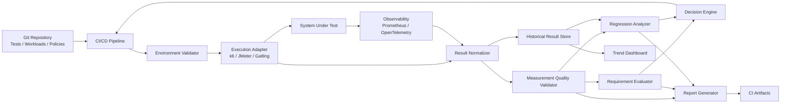

# Continuous Performance Engineering - Research

## 1. Executive Summary

Performance testing is often automated only at the execution level: a pipeline
starts JMeter, k6, Gatling, or another load generator, stores a report, and
perhaps compares a few metrics against fixed thresholds.

That is useful, but it does not yet constitute trustworthy **performance
regression automation**.

The more difficult problem is automatically answering:

> Has the new software version introduced a real and operationally relevant
> performance regression, or is the observed difference caused by normal
> measurement variability?

Industry experience and performance-engineering research show that this
distinction matters. Performance measurements vary because of runtime behavior,
infrastructure, workload characteristics, garbage collection, JIT compilation,
scheduling, cache state, database state, cloud noise, Kubernetes scheduling,
resource contention, and other factors.

MongoDB describes an evolution particularly relevant to this project. Their
early CI implementation compared performance results directly and flagged
changes above roughly 10%. They found that this produced false positives on
noisy tests, missed smaller real regressions, and sometimes identified changes
at the wrong point in history. Their solution evolved toward historical
time-series analysis and change-point detection.

Red Hat has followed a similar maturity path for OpenShift performance testing:
from specialist-owned, late-cycle testing toward automated continuous
performance testing integrated directly into the engineering CI/CD system,
initially as informing jobs and increasingly closer to individual changes and
pull requests.

The proposed project should follow the same principle:

> **Automate measurement first, automate judgement progressively, and introduce
blocking performance gates only after the regression detector has demonstrated
acceptable reliability.**

The implementation should therefore be delivered incrementally rather than
attempting to build a complete statistical performance-analysis platform before
delivering value.

The recommended progression is:

```text
Automated execution
        ↓
Reproducible measurement
        ↓
Performance requirement gates
        ↓
Baseline comparison
        ↓
Noise-aware regression detection
        ↓
Historical change detection
        ↓
Automated diagnosis
        ↓
Continuous performance engineering
```

The system should remain **load-generator independent**. JMeter, k6, Gatling, or
specialized benchmark tools should be execution adapters. Baseline management,
statistical analysis, reporting, observability correlation, and CI/CD decisions
should operate on a common result model.

---

# 2. Project Objective

The project will create a reusable **Continuous Performance Testing (CPT)
platform** capable of automating execution, evaluation, regression detection,
reporting, and eventually diagnosis of performance tests.

The platform should answer four different questions.

### Q1 — Is the system fast enough?

This is a performance requirement question.

Examples:

```text
p95 latency < 300 ms
p99 latency < 750 ms
error rate < 0.5%
throughput >= 400 requests/s
```

### Q2 — Did the candidate become slower?

This is a regression question.

Example:

```text
Reference p95: 210 ms
Candidate p95: 255 ms

Change: +21.4%
```

Even if the candidate still satisfies a 300-ms SLO, the change may represent an
important regression.

### Q3 — Is the observed difference trustworthy?

This is a measurement/statistics question.

For example:

```text
reference: 210 ± 30 ms
candidate: 220 ± 35 ms
```

may not provide convincing evidence of regression.

But:

```text
reference: 210 ± 4 ms
candidate: 255 ± 5 ms
```

provides much stronger evidence.

### Q4 — What caused the regression?

This is a diagnostics question.

For example:

```text
p95 latency          +21%
DB query latency     +37%
application CPU       +3%
CPU throttling         0%
GC pause               0%
```

strongly suggests a different investigation path from:

```text
p95 latency          +21%
application CPU      +42%
CPU throttling       +68%
DB query latency      +1%
```

The proposed architecture treats these four concerns separately.

---

# 3. Why This Project Is Needed

Functional tests normally produce deterministic outcomes:

```text
PASS
FAIL
```

Performance tests generally produce distributions:

```text
Run 1: p95 = 211 ms
Run 2: p95 = 203 ms
Run 3: p95 = 218 ms
Run 4: p95 = 207 ms
Run 5: p95 = 214 ms
```

Running the same software twice does not necessarily produce the same result.

Research by Georges, Buytaert, and Eeckhout demonstrated that performance
measurements in managed runtimes are affected by sources of non-determinism
including JIT compilation, garbage collection, thread scheduling, and system
effects, and argued for statistically rigorous performance evaluation rather
than isolated measurements.

Later work on VM warm-up found an even more difficult problem: benchmark
executions do not necessarily enter steady state after a predetermined warm-up
period. In the studied VM/benchmark combinations, consistent steady-state
behavior was far from universal.

The consequence is important:

> A performance test result must carry information about **measurement
quality**, not merely latency and throughput.

---

# 4. Industry Evidence

## 4.1 Grafana k6: Performance Requirements as Code

k6 explicitly supports automated performance thresholds such as:

```text
p95 < 200 ms
error rate < 1%
```

and returns a non-zero exit code if a threshold fails, making those criteria
suitable for CI/CD automation. Grafana recommends using these thresholds to
codify performance requirements and SLOs.

This supports the first stage of the proposed design:

```text
performance test
      ↓
SLO evaluation
      ↓
pipeline result
```

However, Grafana also warns that for larger tests, relying only on a simple
PASS/FAIL result can create a false sense of security.

This supports separating:

```text
SLO gate
```

from:

```text
regression analysis
```

rather than treating them as the same mechanism.

Useful references:

[Grafana k6 — Thresholds](https://grafana.com/docs/k6/latest/using-k6/thresholds)

[Grafana k6 — Automated performance testing](https://grafana.com/docs/k6/latest/testing-guides/automated-performance-testing)

[Grafana k6 — API load testing guidance](https://grafana.com/docs/k6/latest/testing-guides/api-load-testing)

---

## 4.2 Red Hat OpenShift: Continuous Performance Testing

Red Hat's OpenShift Performance and Scale Team describes an evolution from large
performance tests around releases and architectural changes toward continuous
performance testing integrated into the normal OpenShift CI/CD system.

Several lessons are directly applicable to this project:

- performance testing should use the development team's normal CI/CD
  infrastructure;
- regression detection should move earlier in the development cycle;
- performance environments should be isolated;
- tests should model realistic workloads;
- system/resource metrics should be collected alongside benchmark results;
- tests can initially be **informing rather than blocking**;
- developers should eventually be able to initiate performance tests for
  individual changes.

Red Hat reports that this shift gave engineers earlier feedback and reduced the
number of changes that needed investigation after a regression appeared.

This is particularly relevant where the target platform is Kubernetes or
OpenShift.

[Red Hat — How Red Hat has redefined continuous performance testing](https://developers.redhat.com/articles/2025/10/15/how-red-hat-has-redefined-continuous-performance-testing)

---

## 4.3 Red Hat: Real Regression Detection with Change-Point Analysis

Red Hat has also published a concrete OpenShift regression case in which
automated continuous tests detected approximately:

- 30% increased kubelet CPU consumption;
- 50% increased pod-ready latency.

The regression was automatically flagged by their Orion change-point detection
tooling.

This demonstrates that historical statistical analysis is not merely academic;
it is currently being used in production OpenShift performance engineering.

Orion itself supports regression detection, historical analysis, multiple
algorithms, machine-readable output, and comparisons between PRs and periodic
baselines.

[Red Hat — Kubelet regression case study](https://developers.redhat.com/articles/2025/10/20/case-study-kubelet-regression-openshift)

[Cloud-Bulldozer Orion](https://github.com/cloud-bulldozer/orion)

---

## 4.4 MongoDB: Why Simple Percentage Comparisons Are Not Enough

MongoDB provides one of the strongest industry case studies for this project.

Their original automated performance infrastructure compared new and historical
results using fixed percentage differences.

They found several problems:

- small regressions could be missed;
- noisy benchmarks generated false positives;
- regression detection could happen later than the change that actually caused
  the regression;
- threshold tuning became benchmark-specific and increasingly complicated.

MongoDB eventually reframed the problem from:

> Has this result changed by more than 10%?

to:

> Where did the underlying performance behavior change?

That led to **change-point detection** over historical performance time series.

Their current infrastructure operates at substantial scale, with hundreds of
distinct performance tests and very large numbers of results per commit, using
change-point detection and subsequent triage.

[MongoDB — Using Change Point Detection to Find Performance Regressions](https://www.mongodb.com/blog/post/using-change-point-detection-find-performance-regressions)

This strongly supports historical regression analysis as a later project stage.

---

# 5. Research Evidence

## 5.1 Measurement Variability

Georges et al. argue that single performance measurements or arbitrary
selections such as best/worst runs are insufficient for rigorous performance
evaluation because runtime effects cause substantial non-determinism.

This supports:

```text
multiple independent runs
+
distribution-aware analysis
+
confidence estimation
```

rather than:

```text
one run
+
one percentage
```

[Statistically Rigorous Java Performance Evaluation — Georges, Buytaert & Eeckhout](https://dri.es/files/oopsla07-georges.pdf)

---

## 5.2 Warm-Up and Steady State

Barrett et al. used statistical change-point analysis to examine VM warm-up and
found that different executions of the same benchmark can reach steady state at
different times, while some never reach the expected steady state.

This means:

```text
warmup = exactly one run
```

should be treated as an initial engineering simplification rather than a
permanent scientific assumption.

The architecture should eventually permit:

```text
ramp-up
warm-up
steady-state detection
measurement
cooldown
```

[Virtual Machine Warmup Blows Hot and Cold](https://arxiv.org/abs/1602.00602)

---

## 5.3 Change-Point Detection

The Hunter research project investigated change-point detection specifically for
performance regression detection in noisy performance time series.

Its authors argue that change-point detection is suitable because it can
distinguish sustained performance changes from measurement noise. Hunter
compares approaches and provides an automated algorithm for identifying
regressions and improvements.

This work is particularly relevant because Orion now uses Hunter's successor,
Apache Otava, in Red Hat's continuous-performance tooling.

Apache Otava describes its model as continuous regression detection based on
statistical change-point analysis and historical distributions rather than
fragile point-to-point static thresholds.

[Apache Otava](https://otava.apache.org)

---

## 5.4 Real-World Performance Regression Datasets

Recent research based on Mozilla's performance infrastructure provides further
evidence that regression detection should be treated as a historical time-series
problem.

A published Mozilla dataset contains:

- 5,655 performance time series;
- 17,989 performance alerts;
- expert annotations and associated bug information.

It exists specifically to support research into performance regressions, anomaly
detection, and change-point detection.

This offers a possible external dataset for evaluating later statistical
approaches.

---

## 5.5 Performance Tests Are Expensive

An important part of the problem is feedback time.

Research into test-case prioritization for software microbenchmarks notes that
performance suites can take hours or even days to execute.

Laaber, Gall, and Leitner investigated prioritizing performance benchmarks and
found that the three largest observed performance changes could be detected
after executing roughly **29–66%** of the complete benchmark suite, depending on
the prioritization strategy.

This provides research support for a tiered approach:

```text
PR
 ↓
small high-value test subset

main/nightly
 ↓
representative regression suite

weekly/release
 ↓
complete expensive suite
```

[Applying Test Case Prioritization to Software Microbenchmarks](https://doi.org/10.1007/s10664-021-10037-x)

---

# 6. Core Design Principles

The project should follow the following principles.

## 6.1 Deliver Value Incrementally

Do not wait for sophisticated statistical regression analysis before automating
performance testing.

Each stage must provide independently useful functionality.

---

## 6.2 Separate Measurement from Judgement

The load generator measures performance.

The regression system decides how measurements should be interpreted.

```text
k6 / JMeter / Gatling
          ↓
      measurements
          ↓
 normalized result
          ↓
   analysis system
```

---

## 6.3 Separate SLO Violations from Regressions

Consider:

```text
SLO p95: <500 ms

reference: 250 ms
candidate: 350 ms
```

The candidate:

```text
passes SLO
```

but has:

```text
40% latency regression
```

Conversely:

```text
reference: 550 ms
candidate: 510 ms
```

represents:

```text
performance improvement
+
SLO failure
```

Therefore:

```text
RequirementGate != RegressionGate
```

---

## 6.4 Preserve Raw Evidence

Early versions of the platform may not know the best statistical approach.

Therefore every run should retain enough information to permit future
re-analysis.

At minimum:

```text
test identity
workload identity
candidate version
environment metadata
run-level metrics
distribution/histogram data
resource telemetry
timestamps
```

---

## 6.5 Prefer Explainable Decisions

The system should initially favor transparent decisions such as:

```text
SLO failed because p95=340 ms > 300 ms
```

or:

```text
candidate p95 is 17.8% slower than approved baseline
```

over opaque machine-learning classifications.

More sophisticated algorithms can be introduced after enough historical data
exists.

---

# 7. Performance Test Taxonomy

Different tests answer different questions and belong at different CI/CD stages.

| Test                    | Main Question                                     | Suggested Execution |
|-------------------------|---------------------------------------------------|---------------------|
| Performance smoke       | Is anything catastrophically wrong?               | PR                  |
| Component/API benchmark | Did this component become slower?                 | PR/main             |
| Representative load     | Does normal workload meet requirements?           | main/nightly        |
| Regression suite        | Did overall system performance change?            | nightly             |
| Stress                  | How does the system degrade beyond expected load? | scheduled           |
| Spike                   | Can it tolerate abrupt load changes?              | scheduled           |
| Soak                    | Does performance degrade over time?               | nightly/weekly      |
| Capacity/breakpoint     | What is maximum sustainable load?                 | weekly/release      |

Grafana similarly distinguishes smoke, average-load, stress and breakpoint-style
testing rather than expecting one test configuration to answer every performance
question.

---

# 8. Performance Testing Pyramid

The proposed project should implement a performance-test pyramid.

```text
             ┌───────────────────────┐
             │ Capacity / soak /     │
             │ full-system testing   │
             │ Weekly / Release      │
             └───────────┬───────────┘
                         │
             ┌───────────▼───────────┐
             │ Representative system │
             │ Nightly               │
             └───────────┬───────────┘
                         │
          ┌──────────────▼──────────────┐
          │ Component/API regression    │
          │ PR / Main                   │
          └──────────────┬──────────────┘
                         │
      ┌──────────────────▼──────────────────┐
      │ Microbenchmarks/performance smoke   │
      │ Every relevant PR                   │
      └─────────────────────────────────────┘
```

This addresses the requirement that developers should receive useful information
quickly rather than waiting for a complete long-running test suite.

---

# 9. Workload Specification

A trustworthy result requires a reproducible workload.

Each test should therefore have a versioned workload definition.

Example:

```yaml
workload:
  id: order-service-standard
  version: 4

  execution:
    model: open
    arrivalRate: 450
    warmup: 3m
    measurement: 10m

  operations:
    search-order: 0.35
    get-order: 0.35
    create-order: 0.20
    update-order: 0.10

  dataset:
    version: orders-v7

  objectives:
    p95: 300ms
    p99: 750ms
    errorRate: 0.005
```

At minimum the workload definition should describe:

- request mix;
- load model;
- arrival rate or concurrency;
- ramp-up;
- warm-up;
- steady measurement period;
- think time if applicable;
- dataset;
- authentication model;
- cache assumptions;
- network assumptions;
- expected traffic shape.

---

# 10. Open vs Closed Workload Models

The system should explicitly record whether a workload is:

```text
OPEN
```

or:

```text
CLOSED
```

A closed model typically behaves like:

```text
send request
wait for response
send next request
```

When response times increase, such a test can unintentionally reduce offered
traffic.

An open model schedules requests according to an externally defined arrival
rate:

```text
100 requests/sec
```

regardless of individual response duration.

k6 supports constant-arrival-rate scenarios specifically for this model.

The correct model depends on the real system workload. Neither should be
universally mandated.

---

# 11. Environment Reproducibility

Performance comparison is invalid if important test conditions change without
being recorded.

Every test execution should therefore generate an **environment fingerprint**.

Example:

```yaml
sut:
  gitSha: abc123
  imageDigest: sha256:...
  replicas: 4
  runtime: java-25
  configurationHash: ...

platform:
  kubernetesVersion: ...
  openshiftVersion: ...
  nodeType: ...
  nodeCount: ...
  cpuArchitecture: ...

resources:
  cpuRequest: ...
  cpuLimit: ...
  memoryRequest: ...
  memoryLimit: ...

dependencies:
  postgresVersion: ...
  redisVersion: ...

test:
  generator: k6
  generatorVersion: ...
  workloadVersion: 4
  datasetVersion: orders-v7
```

Comparison should eventually be refused if important dimensions differ:

```text
candidate environment
         ↓
compatibility check
         ↓
 ┌───────┴────────┐
 │                │
valid          incompatible
 │                │
compare       INVALID COMPARISON
```

Red Hat specifically recommends isolated performance environments resembling
production as closely as practical.

---

# 12. Measurement Phases

A test execution should conceptually contain:

```text
PROVISION
    ↓
SETUP
    ↓
RAMP-UP
    ↓
WARM-UP
    ↓
MEASURE
    ↓
COOLDOWN
    ↓
CLEANUP
```

Initially, fixed durations can be used.

Later, warm-up or steady-state detection could become adaptive.

Only the intended measurement interval should normally contribute to regression
metrics.

---

# 13. Number of Runs

The initial proposal used five runs.

That is a sensible engineering starting point but should not be treated as a
universal statistically valid number.

Stage 1 can therefore define:

```text
minimumRuns = 5
```

Later stages can introduce:

```text
minimumRuns
maximumRuns
confidenceTarget
```

and continue execution while uncertainty remains too high:

```text
run
 ↓
estimate uncertainty
 ↓
sufficient confidence?
 ├─ yes → stop
 └─ no  → additional run
```

This can reduce runtime for stable benchmarks while collecting more evidence for
noisy ones.

---

# 14. Statistical Strategy

## 14.1 Stage 1: Descriptive Statistics

Collect:

```text
p50
p90
p95
p99
throughput
error rate
run duration
```

and across repeated runs:

```text
median
mean
minimum
maximum
standard deviation
CV
```

CV should initially be a **noise indicator**, not the regression decision
itself.

---

## 14.2 Stage 2: Practical Difference

Every metric should define a difference large enough to matter operationally.

Example:

```yaml
regressionPolicy:
  p95:
    direction: lower-is-better
    practicalDifference: 0.10

  throughput:
    direction: higher-is-better
    practicalDifference: 0.05
```

Then:

```text
reference p95 = 200 ms
candidate p95 = 204 ms

difference = +2%
```

is not treated as an important regression even if a sufficiently large dataset
could make the difference statistically significant.

---

## 14.3 Stage 3: Uncertainty

Introduce:

```text
confidence intervals
bootstrap intervals
effect-size estimates
```

where appropriate.

A performance result should increasingly look like:

```text
candidate regression: +13.2%
95% CI: +9.4% ... +16.8%
```

rather than:

```text
candidate regression: +13.2%
```

---

## 14.4 Stage 4: Historical Change-Point Detection

After a sufficient history has accumulated, regression detection can evolve
from:

```text
candidate versus one baseline
```

to:

```text
performance time series
        ↓
change-point detector
        ↓
persistent behavioral changes
```

This is the approach supported by MongoDB's experience, Hunter/Apache Otava
research, and Red Hat's Orion tooling.

---

# 15. Why Welch's t-Test Should Not Be the Universal Gate

Welch's t-test is appropriate for certain comparisons of means where its
assumptions are reasonable.

But performance engineering frequently evaluates:

```text
p95
p99
throughput
error rate
```

and latency distributions can be:

```text
skewed
heavy-tailed
multimodal
non-stationary
```

Therefore no single statistical test should become the universal comparator.

Possible later techniques include:

- bootstrap confidence intervals;
- permutation tests;
- Mann–Whitney U where appropriate;
- Welch's t-test for suitable mean comparisons;
- robust statistics;
- change-point detection.

The analysis method should be chosen according to the metric and data
properties.

---

# 16. Baseline Strategy

A single `baseline.json` should not be the final design.

The system should eventually support several reference strategies.

## Approved Baseline

```text
candidate
   vs
known-good release
```

Useful for release qualification.

## Previous Successful Build

```text
candidate
   vs
previous build
```

Useful for detecting immediate changes.

## Rolling Historical Baseline

```text
candidate
   vs
recent valid historical distribution
```

Useful for continuous monitoring.

## Candidate vs Control

```text
known-good version → test
candidate version  → test
```

executed close together under equivalent infrastructure.

This is particularly useful in Kubernetes/cloud environments where
infrastructure variability may be substantial.

---

# 17. Avoid Baseline Drift

Automatically replacing the baseline after every passing test can hide gradual
deterioration.

For example:

```text
Build 1    100 ms
Build 2    103 ms
Build 3    106 ms
Build 4    109 ms
Build 5    112 ms
Build 6    115 ms
```

Every individual comparison may look acceptable.

The cumulative change is 15%.

Therefore maintain both:

```text
approved reference
+
rolling history
```

This allows detection of:

```text
step regressions
```

and:

```text
gradual degradation
```

---

# 18. Proposed Architecture



---

# 19. Tool Independence

The platform should define a normalized result contract.

```text
JMeter ──┐
         │
k6 ──────┼──> adapter ──> normalized-result.json
         │
Gatling ─┤
         │
other ───┘
```

Example:

```json
{
  "schemaVersion": 1,
  "run": {
    "id": "...",
    "timestamp": "...",
    "tool": "k6",
    "toolVersion": "...",
    "testId": "order-service-standard",
    "testVersion": "4"
  },
  "sut": {
    "version": "...",
    "imageDigest": "..."
  },
  "environment": {},
  "workload": {},
  "metrics": {
    "latencyMs": {
      "p50": 91,
      "p90": 151,
      "p95": 205,
      "p99": 512
    },
    "throughputRps": 452,
    "errorRate": 0.002
  }
}
```

All components after normalization should be independent of the test generator.

---

# 20. Proposed Pipeline

```text
 1. validate-test-definition
 2. resolve-reference
 3. capture-environment
 4. provision-or-validate-target
 5. prepare-dataset
 6. execute-warmup
 7. execute-measurement-runs
 8. normalize-results
 9. validate-measurement-quality
10. evaluate-performance-requirements
11. evaluate-regression
12. collect-diagnostics
13. classify-result
14. generate-report
15. store-results
16. apply-quality-gate
17. cleanup
```

The important distinction from a traditional performance-test pipeline is:

```text
execution
≠
measurement validation
≠
SLO evaluation
≠
regression analysis
≠
release decision
```

---

# 21. Result Classification

Do not initially reduce every outcome to PASS or FAIL.

Use:

| Result       | Meaning                                                    |
|--------------|------------------------------------------------------------|
| PASS         | No material problem detected                               |
| WARN         | Possible regression worth investigation                    |
| FAIL         | High-confidence material regression or requirement failure |
| UNSTABLE     | Measurement variance too high                              |
| INVALID      | Test or environment invalid                                |
| INCONCLUSIVE | Insufficient evidence                                      |

This is especially important during adoption.

A noisy measurement should not be reported as:

```text
APPLICATION REGRESSION
```

when the correct result is:

```text
MEASUREMENT INCONCLUSIVE
```

---

# 22. Observability Integration

Client-side load-generator metrics alone rarely identify the cause of a
regression.

During the same measurement interval collect:

## Application

```text
request duration
request rate
error rate
queue depth
connection pools
thread pools
heap
GC
CPU
```

## Kubernetes/OpenShift

```text
container CPU
container memory
CPU throttling
pod restarts
node CPU
node memory
network
disk I/O
pod scheduling delays
HPA events
```

## Database

```text
query latency
connections
locks
buffer/cache metrics
disk I/O
```

## Distributed Tracing

Where available, OpenTelemetry can connect observed client latency to downstream
components.

Example:

```text
HTTP request +120 ms
       │
       ├── application +5 ms
       ├── cache        +1 ms
       └── database   +114 ms
```

This transforms performance automation from detection toward diagnosis.

---

# 23. Kubernetes/OpenShift Tooling Worth Evaluating

The project should not unnecessarily reproduce existing OpenShift performance
tooling.

## kube-burner

kube-burner is designed for Kubernetes/OpenShift performance and scalability
workloads and can collect Prometheus metrics during benchmark execution.

It is particularly relevant for:

```text
cluster-density
node-density
control-plane performance
object creation
OpenShift scale testing
```

rather than replacing application-level JMeter/k6 tests.

## Benchmark Operator

Benchmark Operator is designed to execute common Kubernetes benchmark workloads
and establish performance baselines.

It demonstrates useful patterns around:

```text
benchmark orchestration
Kubernetes-native execution
metadata
metric collection
```

## Orion

Orion should be investigated directly rather than automatically implementing a
new change-point detector.

It provides:

```text
historical regression detection
multiple algorithms
JSON/JUnit output
PR comparison
metadata integration
```

and is part of Red Hat's current OpenShift continuous-performance work.

---

# 24. Result Storage

## Stage 1

Use:

```text
Git
+
CI artifacts
```

Git contains:

```text
tests
workload definitions
policies
approved baseline metadata
small summary reports
```

CI artifact storage contains:

```text
JTL
k6 JSON
HTML reports
large raw files
logs
```

Do not continuously commit large raw results to the main repository.

---

# 25. Historical Storage

When historical analysis becomes necessary, introduce an appropriate store.

Possible approaches include:

```text
Prometheus-compatible long-term storage
OpenSearch
PostgreSQL/TimescaleDB
InfluxDB
object storage + analytical service
```

The exact implementation should depend on infrastructure already available.

---

# 26. Pushgateway Consideration

Prometheus Pushgateway should not automatically become the historical benchmark
database.

Prometheus explicitly recommends Pushgateway only for limited use cases. It
notes that pushed series remain until explicitly deleted and warns that
Pushgateway can become a bottleneck or single point of failure.

It may still make sense for a few service-level batch-job metrics such as:

```text
performance_test_last_success
performance_test_timestamp
performance_test_duration
```

but not necessarily for complete long-term performance histories.

[Prometheus — When to use the Pushgateway](https://prometheus.io/docs/practices/pushing)

---

# 27. Reporting

Every run should produce a concise machine- and human-readable report.

Example:

## Identity

```text
Test:              order-service-standard
Candidate:         a7d9134
Reference:         release-2026.08
Workload:          v4
Environment:       ocp-perf-03
```

## Requirement Evaluation

| Metric | Requirement | Current | Result |
|--------|------------:|--------:|--------|
| p95    |     <300 ms |  238 ms | PASS   |
| p99    |     <750 ms |  691 ms | PASS   |
| errors |       <0.5% |   0.18% | PASS   |

## Regression Evaluation

| Metric     | Reference | Candidate | Change | Result |
|------------|----------:|----------:|-------:|--------|
| p95        |    205 ms |    238 ms | +16.1% | WARN   |
| p99        |    665 ms |    691 ms |  +3.9% | PASS   |
| throughput |       452 |       448 |  -0.9% | PASS   |

## Measurement Quality

```text
Runs:                  5
Warm-up:               valid
Environment:           compatible
Generator saturation:  no
Run variability:       acceptable
```

## Diagnostic Changes

```text
application CPU       +4%
database p95          +29%
CPU throttling          0%
GC pause               +2%
```

## Final Result

```text
SLO:         PASS
REGRESSION:  WARN
TEST HEALTH: PASS

OVERALL: WARN
```

---

# 28. Delivery Strategy

The project should deliberately avoid a "big bang."

## Phase 1 — Automated Execution

### Goal

Remove manual execution.

### Implement

- pipeline-triggered JMeter/k6 execution;
- version-controlled tests;
- fixed warm-up;
- repeated measurement runs;
- machine-readable output;
- CI artifacts;
- Markdown summary.

### Initial metrics

```text
p50
p90
p95
p99
throughput
error rate
```

### No automatic regression blocking.

### Value Delivered

Anyone can execute the test reproducibly and obtain a standardized report.

---

# 29. Phase 2 — Performance Requirements as Code

Introduce SLO/performance gates.

Example:

```text
p95 < 300 ms
p99 < 750 ms
error rate < 0.5%
throughput >= 400 rps
```

Use native tool capabilities where possible.

For example, k6 thresholds are explicitly designed to turn performance
requirements into CI-compatible pass/fail conditions.

### Value Delivered

The pipeline automatically detects clear violations of agreed performance
requirements.

---

# 30. Phase 3 — Basic Regression Detection

Introduce:

```text
approved baseline
normalized result model
environment fingerprint
relative comparison
```

Initial decision rules may intentionally remain simple:

```text
p95 regression >10% → WARN
throughput regression >5% → WARN
```

The result should initially be **informational**.

Do not immediately fail production releases.

### Value Delivered

Developers receive automated evidence that their version differs from known-good
performance.

---

# 31. Phase 4 — Collect and Understand Measurement Noise

Before selecting sophisticated statistical algorithms, gather enough data from
the real environment.

For each test determine:

```text
normal variance
day-to-day variance
environment variance
minimum detectable difference
frequency of outliers
```

Run controlled experiments repeatedly without changing the software.

This produces the project's own empirical measurement-noise model.

### Value Delivered

Thresholds cease to be arbitrary numbers.

---

# 32. Phase 5 — Statistical Regression Detection

Introduce:

```text
confidence intervals
effect-size thresholds
robust comparison
adaptive sample counts
INCONCLUSIVE classification
```

Algorithms should be validated using intentionally injected regressions.

For example:

```text
+5 ms artificial delay
+10 ms
+25 ms
restricted CPU
database delay
network latency
memory pressure
```

Measure detector quality:

```text
true positive rate
false positive rate
false negative rate
minimum detectable regression
```

### Value Delivered

The system begins producing defensible regression decisions.

---

# 33. Phase 6 — Historical Change-Point Detection

Once sufficient historical data exists, evaluate:

```text
Apache Otava
Orion
custom change-point analysis
```

against the project's collected dataset.

Detect:

```text
temporary spike
persistent step change
gradual degradation
```

rather than relying only on candidate-versus-baseline comparisons.

### Value Delivered

The platform detects regressions that point comparisons cannot reliably
identify.

---

# 34. Phase 7 — Observability-Assisted Diagnosis

Correlate performance measurements with:

```text
Prometheus
OpenTelemetry
OpenShift telemetry
database metrics
application metrics
```

Automatically show the strongest correlated changes in the report.

### Value Delivered

Engineers receive evidence about likely causes rather than only notification
that something became slower.

---

# 35. Phase 8 — Change-Aware Test Selection

Long performance suites should not necessarily execute completely on every pull
request.

Research into performance benchmark prioritization supports executing tests with
the greatest probability of detecting important changes first.

Potential inputs include:

```text
changed components
code coverage
historical regressions
test duration
test failure history
service dependency graph
```

Example:

```text
PR modifies database access layer
              ↓
prioritize:
  database-heavy workloads
  repository benchmarks
  transaction benchmarks
              ↓
defer unrelated soak/capacity tests
```

### Value Delivered

Performance feedback becomes practical within developer CI time budgets.

---

# 36. Phase 9 — Automatic Regression Localization

A detected regression may occur between:

```text
good nightly build
```

and:

```text
bad nightly build
```

with 30 commits in between.

A later-stage system can automatically bisect the commit range:

```text
good ───────────────────── bad
                ↓
              midpoint
             /        \
          good         bad
                       ↓
                    midpoint
```

Red Hat has explored exactly this pattern with an automated performance
regression bisect proof of concept.

### Value Delivered

The platform moves from:

> There is a regression.

toward:

> Commit `abc123` is the probable regression-introducing change.

---

# 37. Maturity Model

| Level | Capability                        |
|-------|-----------------------------------|
| 0     | Manual performance testing        |
| 1     | Automated execution               |
| 2     | Standardized reporting            |
| 3     | SLO quality gates                 |
| 4     | Baseline comparison               |
| 5     | Measurement quality validation    |
| 6     | Statistical regression detection  |
| 7     | Historical change-point detection |
| 8     | Observability-assisted diagnosis  |
| 9     | Change-aware test selection       |
| 10    | Automatic regression localization |

This maturity model allows the project to demonstrate progress continuously.

---

# 38. Proposed Initial MVP

The MVP should deliberately remain small.

Implement:

```text
1. one representative JMeter or k6 workload
2. reusable CI execution wrapper
3. explicit warm-up phase
4. five measurement runs
5. normalized result schema
6. environment metadata
7. SLO evaluation
8. simple baseline comparison
9. PASS/WARN/INVALID classification
10. Markdown report
11. raw CI artifacts
12. historical normalized-result retention
```

Do **not** initially implement:

```text
machine learning
complex anomaly detection
dynamic benchmark selection
automatic bisect
full Grafana infrastructure
automatic baseline promotion
blocking statistical regression gate
```

The MVP's most important secondary purpose is to begin generating trustworthy
historical data.

---

# 39. MVP Acceptance Criteria

The first project milestone succeeds when:

### Execution

- tests can run without manual intervention;
- the same workload can be executed repeatedly;
- execution is reproducible from version-controlled configuration.

### Traceability

Every result identifies:

```text
SUT version
test version
workload version
environment
test tool/version
timestamp
```

### Measurement

At least:

```text
p50
p90
p95
p99
throughput
error rate
```

are captured.

### Requirements

Configured SLOs are automatically evaluated.

### Regression

A candidate can be compared to an approved reference.

### Reporting

A standardized human-readable summary and raw machine-readable artifact are
generated.

### Safety

Unstable or invalid tests can be classified separately from application
failures.

### History

Normalized results can later be queried and re-analyzed.

---

# 40. Research Questions for the Project

The project can itself become an empirical performance-engineering study.

## RQ1

How variable are the existing performance workloads under unchanged software and
infrastructure?

## RQ2

How many repeated runs are necessary to detect regressions of:

```text
5%
10%
20%
```

with acceptable reliability?

## RQ3

Which metrics provide the strongest regression signal?

For example:

```text
p95
p99
throughput
CPU
database latency
```

## RQ4

Does candidate-versus-reference execution reduce false positives compared with
historical baseline comparison?

## RQ5

How accurately do fixed percentage thresholds detect deliberately injected
regressions?

## RQ6

Does change-point detection outperform fixed thresholds on the collected
history?

## RQ7

How much test execution time can be saved through test selection or
prioritization without materially reducing regression-detection effectiveness?

These questions make the work substantially more defensible than simply
implementing a comparator.

---

# 41. Trustworthiness Validation

Before regression detection becomes a blocking CI gate, intentionally evaluate
the detector.

Create known experimental conditions.

Example:

| Experiment      | Expected Effect      |
|-----------------|----------------------|
| unchanged build | no regression        |
| +5 ms delay     | small regression     |
| +25 ms delay    | clear regression     |
| CPU limit -25%  | resource regression  |
| slower DB query | DB-driven regression |
| network delay   | latency regression   |

For each detector calculate:

```text
true positives
true negatives
false positives
false negatives
```

The project can then state, for example:

```text
Regressions ≥10%:
  detection rate: 96%
  false-positive rate: 3%
```

That is far more trustworthy than saying:

```text
We selected 10% because it looked reasonable.
```

---

# 42. Recommended Technology Direction

The architecture should not mandate one load generator.

A reasonable initial implementation could use:

```text
k6 and/or JMeter
        │
        ▼
result adapters
        │
        ▼
normalized JSON
        │
        ├── SLO evaluator
        ├── baseline comparator
        ├── report generator
        └── historical publisher
```

Later:

```text
normalized history
        │
        ├── Orion / Apache Otava
        ├── custom statistical analysis
        └── Grafana visualization
```

For OpenShift-specific infrastructure tests:

```text
kube-burner
Benchmark Operator
```

should be evaluated rather than recreated.

---

# 43. Recommended Repository Structure

```text
performance-automation/
├── tests/
│   ├── jmeter/
│   └── k6/
│
├── workloads/
│   └── order-service/
│       └── standard.yaml
│
├── policies/
│   ├── slo/
│   └── regression/
│
├── schemas/
│   └── normalized-result.schema.json
│
├── adapters/
│   ├── jmeter/
│   └── k6/
│
├── analysis/
│   ├── quality/
│   ├── baseline/
│   └── statistics/
│
├── reporting/
│
├── pipeline/
│
├── research/
│   ├── measurement-variance.md
│   ├── baseline-strategy.md
│   └── regression-detection.md
│
└── README.md
```

This keeps:

```text
test execution
analysis
policy
reporting
research
```

separate.

---

# 44. Risks

## False Positive Regressions

**Risk:** developers stop trusting the system.

**Mitigation:**

```text
WARN before FAIL
measurement-quality validation
environment fingerprinting
reproduction before blocking
```

---

## False Negatives

**Risk:** meaningful regressions escape detection.

**Mitigation:**

```text
approved baseline
historical comparison
tail metrics
multiple workload types
detector calibration
```

---

## Excessive CI Duration

**Risk:** developers bypass performance testing.

**Mitigation:**

```text
performance-test pyramid
PR subset
nightly full suite
parallel execution where scientifically valid
future test prioritization
```

---

## Environment Noise

**Risk:** infrastructure variation is interpreted as application regression.

**Mitigation:**

```text
dedicated workers
resource isolation
environment metadata
candidate/control comparison
measurement-health checks
```

---

## Baseline Drift

**Risk:** gradual degradation becomes normalized.

**Mitigation:**

```text
approved reference
+
rolling historical baseline
```

---

## Repository Growth

**Risk:** raw performance results make Git unusable.

**Mitigation:**

```text
Git → definitions + summaries

artifact/history store → raw results
```

---

# 45. Key Project Principle

The central design principle should be:

> **A performance regression result is itself a measurement whose reliability
must be demonstrated.**

The platform should not say:

```text
p95 increased by 11%
therefore FAIL
```

without eventually considering:

```text
Was the workload valid?
Was the environment comparable?
Was the generator saturated?
Was the system warmed up?
Was the result stable?
Is the difference reproducible?
Is the difference statistically credible?
Is the difference operationally important?
```

---

# 46. Recommended Project Direction

The project should start as a **Continuous Performance Testing Automation
Platform**, not as a "statistical comparator project."

Its initial architecture should support sophisticated analysis without requiring
sophisticated analysis immediately.

The recommended sequence is:

```text
Phase 1
Automate existing tests
        ↓
Phase 2
Codify performance requirements
        ↓
Phase 3
Add simple reference comparison
        ↓
Phase 4
Characterize real measurement noise
        ↓
Phase 5
Introduce statistically defensible comparison
        ↓
Phase 6
Add historical change-point detection
        ↓
Phase 7
Correlate application/platform telemetry
        ↓
Phase 8
Optimize feedback through test selection
        ↓
Phase 9
Automate regression localization
```

This sequence produces useful results from the first delivery while preserving a
clear path toward a considerably more sophisticated system.

It also reflects what established engineering organizations have learned in
practice: Red Hat evolved OpenShift performance testing incrementally toward
continuous CI-integrated regression detection; MongoDB evolved from fixed
percentage comparison toward historical change-point analysis; Grafana treats
explicit thresholds as useful CI quality gates but warns against treating simple
pass/fail as sufficient for larger performance validation; and academic research
shows both that measurement rigor matters and that prioritization can reduce the
feedback cost of expensive performance suites.

The immediate objective should therefore be:

> **Build the smallest system that produces reproducible performance
measurements and retains enough evidence to improve the decision algorithm
scientifically over time.**

That makes the first delivery useful within a short timeframe while ensuring
that later regression automation is based on measured evidence rather than
arbitrary thresholds.